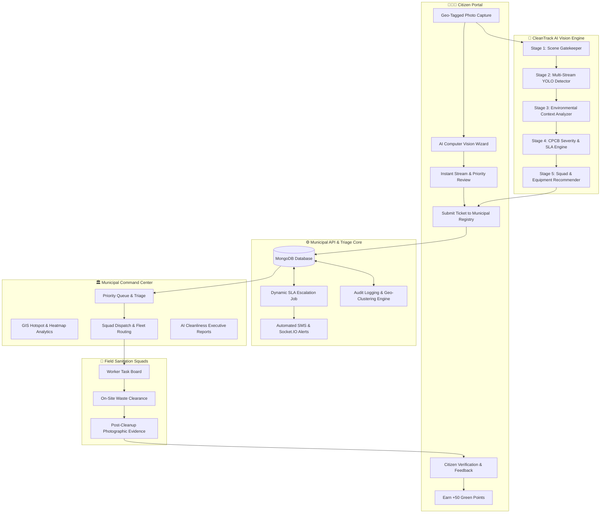

# CleanTrack 2.0 — AI-Powered Civic Cleanliness & Smart Municipal Triage Platform 🌿🏙️

[](https://www.sih.gov.in/)
[](https://react.dev/)
[](https://nodejs.org/)
[](https://www.mongodb.com/)
[](https://ultralytics.com/)
[](https://tailwindcss.com/)
[](https://opensource.org/licenses/MIT)

> **"Report. Detect. Prioritize. Dispatch. Clean. Verify."**  
> *An end-to-end, closed-loop urban cleanliness operating system that bridges citizens, municipal authorities, and sanitation squads with real-time AI computer vision and dynamic SLA governance.*

---

## 📌 Problem Statement (SIH Smart City Challenge)

Rapid urban expansion has led to overwhelming solid waste generation across Indian metropolitan cities. Traditional municipal grievance systems suffer from critical systemic bottlenecks:
1. **Unstructured Civic Complaints**: Citizens submit blurry photos with vague descriptions without automated classification or waste stream segregation.
2. **Absence of Quantitative Sizing**: Municipal officers cannot determine the physical volume ($m^3$, Liters) or payload weight (kg) of waste accumulations before dispatching crews, leading to inappropriate equipment deployment (e.g., small handcarts sent to heavy compactor-level heaps).
3. **Unidentified Biohazard & Toxic Hazards**: Clinical sharps, hospital syringes, and discarded lithium e-waste are dumped alongside domestic waste, exposing sanitation workers to lethal infections and toxic chemical poisoning.
4. **Static & Opaque SLAs**: Complaints sit in municipal backlogs without time-based escalations or transparent status accountability.
5. **Lack of Closed-Loop Verification**: Work tickets are frequently marked "Resolved" on paper without independent before-and-after photographic proof or citizen verification.

---

## 💡 The CleanTrack Solution

CleanTrack solves this with a **closed-loop civic cleanliness ecosystem** featuring an intelligent multi-stream computer vision pipeline:

$$\textbf{Citizen Photo} \longrightarrow \textbf{5-Stage AI Vision} \longrightarrow \textbf{Dynamic SLA Triage} \longrightarrow \textbf{Squad Dispatch} \longrightarrow \textbf{Before/After Evidence} \longrightarrow \textbf{Citizen Verification} \longrightarrow \textbf{Green Points}$$

### 🌟 Key Innovations:
- **Hierarchical 5-Stage AI Computer Vision**: Integrates YOLOv8, MobileNetV3 Scene Gatekeeping, and specialized clinical biohazard classifiers.
- **Physical Volume & Weight Estimation**: Pinpoints 3D volume (Liters, $m^3$) and material density weight (kg/g) directly from 2D images using bounding box spatial displacement.
- **4-Stream Separation**: Segmented into **Plastic/Dry Recyclables**, **Biomedical/Biohazards**, **E-Waste**, and **Degradable vs. Biodegradable** streams.
- **CPCB-Aligned Dynamic SLA Engine**: Dynamically calculates priority scores (0–100) and binds each ticket to strict 12h, 24h, or 48h resolution deadlines with automatic escalation.
- **Citizen Gamification & Green Points**: Rewards verified reports with points redeemable for utility subsidies and civic perks.
- **Field Worker Evidence Verification**: Two-step validation requiring photographic proof and before/after slider comparison before ticket closure.

---

## 🏗️ System Architecture



---

## 📁 Repository Structure

```
SIH_website/
├── frontend/                          # React 19 + Vite + Tailwind CSS Frontend
│   ├── public/                        # Static assets, civic logos, and icons
│   ├── src/
│   │   ├── assets/                    # Illustrations & static media
│   │   ├── components/                # Modular UI components (ai, common, complaints, maps, worker)
│   │   ├── context/                   # Global State (AuthContext, ComplaintContext, NotificationContext)
│   │   ├── data/                      # Category definitions, mock telemetry, and squads
│   │   ├── hooks/                     # Custom React hooks
│   │   ├── layouts/                   # Layouts (Citizen, Municipal, Worker, Admin, Public)
│   │   ├── pages/                     # Application screens across all 4 user roles
│   │   ├── routes/                    # Declarative routing & RBAC route guards
│   │   ├── services/                  # API communication layer with offline local fallbacks
│   │   ├── App.jsx                    # Root application component
│   │   └── main.jsx                   # Vite entrypoint
│   ├── index.html                     # HTML5 shell
│   ├── package.json                   # Frontend dependencies
│   ├── vite.config.js                 # Vite bundler configuration
│   ├── tailwind.config.js             # Custom Tailwind color palette and design tokens
│   └── postcss.config.js
│
├── backend/                           # Node.js + Express.js REST API & MongoDB Database
│   ├── src/
│   │   ├── config/                    # Database connection (Mongoose) & Environment variables
│   │   ├── controllers/               # Business controllers (complaints, auth, analytics, rewards)
│   │   ├── middleware/                # JWT auth guards, role-based authorization, rate limiters
│   │   ├── models/                    # Mongoose schemas (Complaint, User, AIAnalysis, Assignment, etc.)
│   │   ├── routes/                    # API endpoints (/api/complaints, /api/auth, /api/analytics)
│   │   ├── services/                  # AI runner, SMS notification service, reward point engine
│   │   ├── scripts/                   # Database seeder (seed.js)
│   │   ├── utils/                     # Priority calculators, complaint ID generator, SLA utils
│   │   ├── app.js                     # Express application definition
│   │   └── server.js                  # HTTP server & WebSocket initialization
│   ├── models/                        # Pre-packaged model checkpoints (.pt, .pth)
│   ├── uploads/                       # User-uploaded incident and evidence images
│   ├── package.json                   # Backend dependencies
│   ├── .env.example                   # Backend environment template
│   └── API_DOCUMENTATION.md           # REST API specification
│
├── ai/                                # AI Computer Vision Subsystem & YOLO Pipelines
│   ├── models/                        # Trained weights (.pt, .pth)
│   │   ├── best.pt                    # YOLOv8 Plastic & Dry Recyclable waste detector
│   │   ├── biomedical_best.pt         # Clinical sharps & biohazard detector
│   │   ├── ewaste_best.pt             # Discarded electronics & battery detector
│   │   ├── degradable_best.pt         # Degradable vs. Biodegradable 6-class model
│   │   ├── best_medical_classifier.pth# ResNet/ViT clinical biohazard classifier
│   │   └── yolov8n.pt                 # YOLOv8 Nano base model
│   ├── pipelines/                     # Inference & execution pipelines
│   │   ├── predict.py                 # Primary Python runner for CLI & backend child processes
│   │   ├── pipeline.py                # 5-stage hierarchical orchestrator
│   │   ├── stage1_gatekeeper.py       # Scene context & indoor non-waste suppressor
│   │   ├── stage2_detector.py         # Multi-object detection & Soft-NMS union engine
│   │   ├── condition_analyzer.py      # Spatial spread & gutter blockage assessment
│   │   ├── severity_engine.py         # CPCB severity formula & SLA deadline calculator
│   │   └── municipal_action.py        # Squad, PPE, and equipment recommendations
│   ├── training/                      # Dataset prep, training, and evaluation scripts
│   │   ├── train_improved_model.py
│   │   ├── evaluate_model.py
│   │   ├── prepare_unified_dataset.py
│   │   └── error_analysis.py
│   ├── datasets/                      # Dataset configs and sample validation images
│   ├── requirements.txt               # Python package dependencies
│   └── README.md                      # AI engine documentation
│
├── docs/                              # Project Documentation, Executive Reports & PDFs
│   ├── CleanTrack_Master_Project_Report.pdf
│   ├── CleanTrack_Comprehensive_Project_Report.pdf
│   ├── CleanTrack_Features_and_Roadmap.pdf
│   ├── CleanTrack_Workflow_and_Module_Actions_Report.pdf
│   └── generate_pdf_report.py
│
├── package.json                       # Monorepo runner scripts (runs frontend & backend)
├── .gitignore                         # Comprehensive gitignore rule set
└── README.md                          # Main project documentation
```

---

## 🛠️ Tech Stack & Technologies

| Layer | Technologies Deployed |
| :--- | :--- |
| **Frontend UI/UX** | React 19, Vite, Tailwind CSS, Lucide React, Canvas Confetti |
| **Mapping & GIS** | Leaflet, React-Leaflet, OpenStreetMap Cartography |
| **Charts & Analytics**| Recharts (Multi-stream bar charts, circular progress meters) |
| **Backend API** | Node.js, Express.js (Modular MVC Architecture) |
| **Database & ORM** | MongoDB Atlas / Local MongoDB, Mongoose ODM (`2dsphere` GeoJSON indexing) |
| **Authentication** | JSON Web Tokens (JWT), Bcrypt password hashing, Role-Based Access Control |
| **AI / Deep Learning**| PyTorch, Ultralytics YOLOv8, OpenCV, Pillow, Soft-NMS |
| **Realtime Engine** | Socket.IO (WebSockets), Node-Cron (Background SLA escalator) |

---

## 🚀 Quick Start & Installation

### 1. Prerequisites
- **Node.js**: v18.0.0 or higher
- **npm**: v9.0.0 or higher
- **MongoDB**: Local MongoDB instance (`mongodb://localhost:27017`) or MongoDB Atlas URI
- **Python**: 3.9+ (Optional, only required for local AI re-training / inference)

---

### 2. Clone the Repository
```bash
git clone https://github.com/your-username/SIH_CleanTrack.git
cd SIH_CleanTrack
```

---

### 3. Install All Dependencies
Install root, frontend, and backend packages in one command:
```bash
npm run install:all
```
*(Or manually run `cd frontend && npm install` and `cd ../backend && npm install`)*

---

### 4. Configure Environment Variables

#### Backend Environment
Create `backend/.env` (or copy from `backend/.env.example`):
```env
PORT=5000
NODE_ENV=development
MONGO_URI=mongodb://localhost:27017/cleantrack
JWT_SECRET=cleantrack_super_secure_jwt_secret_key_2026
CLIENT_URL=http://localhost:5173
```

#### Frontend Environment
Create `frontend/.env` (optional, defaults to `http://localhost:5000/api`):
```env
VITE_API_URL=http://localhost:5000/api
```

---

### 5. Seed Database with Demo Civic Data
Initialize system settings, municipal accounts, wards, squads, and users:
```bash
npm run seed
```

---

### 6. Run the Platform

From the project root directory, run both frontend and backend concurrently or independently:

```bash
# Terminal 1 — Start Backend Server (Port 5000)
npm run server

# Terminal 2 — Start Frontend Application (Port 5173)
npm run client
```

Now open **`http://localhost:5173`** in your browser! 🌐

---

## 🔑 Demo Login Accounts

| Role | Email | Password | Persona & Privileges |
| :--- | :--- | :--- | :--- |
| 🧑‍🤝‍🧑 **Citizen** | `prathamesh@cleantrack.gov` | `Prathamesh@123` | Prathamesh Hadole — Report waste, track status, verify cleanup, earn Green Points |
| 🏛️ **Municipal Officer**| `officer@cleantrack.gov` | `Municipal@123` | Vikram Deshmukh — Priority Queue triage, assign squads, view AI analytics, approve SLA |
| 👷 **Sanitation Worker** | `worker@cleantrack.gov` | `Worker@123` | Ramesh Shinde (Squad Alpha) — View task route, update status, upload before/after photos |
| 🛡️ **Administrator** | `admin@cleantrack.gov` | `Admin@123` | System Administrator — System settings, user registry, AI monitoring, SLA config |

> **Pro-Tip**: You can switch personas instantly using the **Role Switcher Dropdown** in the top navigation bar during live demonstrations!

---

## 🧠 AI Multi-Stream Computer Vision Architecture

The CleanTrack AI pipeline executes 5 sequential stages in $< 200\text{ms}$:

```
                    Raw Civic Waste Photo
                             │
                             ▼
  ┌────────────────────────────────────────────────────────┐
  │ 1. STAGE 1: Fast Scene Gatekeeper (MobileNetV3)        │
  │    - Suppresses indoor scenes (living rooms, bedrooms) │
  │    - Prevents false-positive civic dispatches          │
  └──────────────────────────┬─────────────────────────────┘
                             │
                             ▼
  ┌────────────────────────────────────────────────────────┐
  │ 2. STAGE 2: Multi-Model Object Detector (YOLOv8)       │
  │    - Plastic Stream: PET Bottles, HDPE, Films, Cans    │
  │    - Biomedical Stream: Syringes, Needles, Gauze, PPE  │
  │    - E-Waste Stream: PCBs, Batteries, Electronics      │
  │    - Degradable Stream: Cardboard, Paper, Organics     │
  │    - Non-Overlapping Spatial Union Coverage Grid       │
  └──────────────────────────┬─────────────────────────────┘
                             │
                             ▼
  ┌────────────────────────────────────────────────────────┐
  │ 3. STAGE 3: Physical Volume & Mass Calculation         │
  │    - Bounding Box Displacement -> Liters & m³          │
  │    - Material Polymer Density -> Estimated Weight (kg) │
  │    - Container Sizing (0.5x 10L Bag to 50L Sack)       │
  └──────────────────────────┬─────────────────────────────┘
                             │
                             ▼
  ┌────────────────────────────────────────────────────────┐
  │ 4. STAGE 4: CPCB Severity & Priority Scoring Matrix    │
  │    - Severity = Waste Type (35%) + Visual Extent (30%) │
  │               + Location Risk (15%) + Recurrence (10%) │
  │               + Time Factor (10%)                      │
  │    - Priority Level: Normal, Medium, High, Critical    │
  └──────────────────────────┬─────────────────────────────┘
                             │
                             ▼
  ┌────────────────────────────────────────────────────────┐
  │ 5. STAGE 5: Municipal Routing & Action Recommendation  │
  │    - Squad Assignment (Alpha/Bravo/Charlie/Delta)      │
  │    - Mandatory PPE Sizing (Level A, B, or C)           │
  │    - Disposal Destination (MRF, CBWTF, Composter, EPR) │
  └────────────────────────────────────────────────────────┘
```

---

## ⏱️ Dynamic SLA Governance & Escalation

Each complaint receives an automated resolution deadline upon AI triage:
- 🔴 **Critical Hazard (Score $\ge 80$)**: **12 Hours SLA** (Biohazards, open drain obstructions)
- 🟠 **High Priority (Score $60 - 79$)**: **18 Hours SLA** (Heavy roadside accumulations)
- 🟡 **Medium Priority (Score $40 - 59$)**: **24 Hours SLA** (Market litter heaps)
- 🟢 **Normal / Low (Score $< 40$)**: **48 Hours SLA** (Isolated minor litter)

### Automatic SLA Escalation Engine:
- A background cron worker (`node-cron`) inspects tickets every hour.
- If `Date.now() > dueAt` and status is unresolved:
  1. Priority level is escalated to **`CRITICAL`**.
  2. Escalation level increments (`escalationLevel += 1`).
  3. Real-time WebSocket notifications fire to Municipal Command and Admin.
  4. An immutable `AuditLog` entry is written with breach telemetry.

---

## 📱 Mobile-Responsive Field Worker Terminal

Sanitation workers in the field access a specialized high-contrast, touch-optimized terminal:
1. **Dispatched Tasks**: Sorted by proximity and SLA urgency.
2. **One-Tap Status Transition**: Start Task $\rightarrow$ In Progress $\rightarrow$ Submit Evidence.
3. **Photographic Evidence Upload**: Uploads post-cleanup photo with diverted weight estimate.
4. **Before/After Split Verification**: Instant side-by-side photometric comparison for citizen sign-off.

---

## 🏆 Smart India Hackathon (SIH) Compliance Checklist

- [x] **Theme**: Smart Automation / Clean India / Urban Civic Governance
- [x] **Working Prototype**: Full-stack application with live working frontend, backend, and AI pipeline
- [x] **Role-Based Access Control**: 4 complete distinct roles (Citizen, Municipal, Worker, Admin)
- [x] **AI / Computer Vision**: Multi-stream YOLOv8 model with volume/weight estimation
- [x] **GIS & Geospatial Tagging**: Leaflet maps with coordinate pinpointing & ward clustering
- [x] **Closed-Loop Verification**: Double-blind before/after photo verification
- [x] **Citizen Gamification**: Green Points reward ledger for civic engagement
- [x] **Offline Resilience**: Full offline fallback storage for demonstration safety

---

## 📄 License

This project is licensed under the MIT License — see the [LICENSE](LICENSE) file for details.

---

<p align="center">
  <b>Developed for Smart India Hackathon 2026</b><br />
  <i>CleanTrack Engineering Team</i>
</p>
